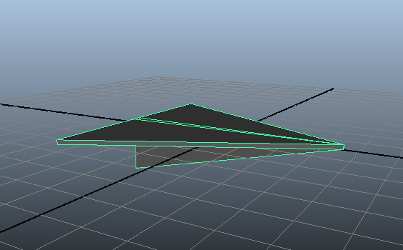
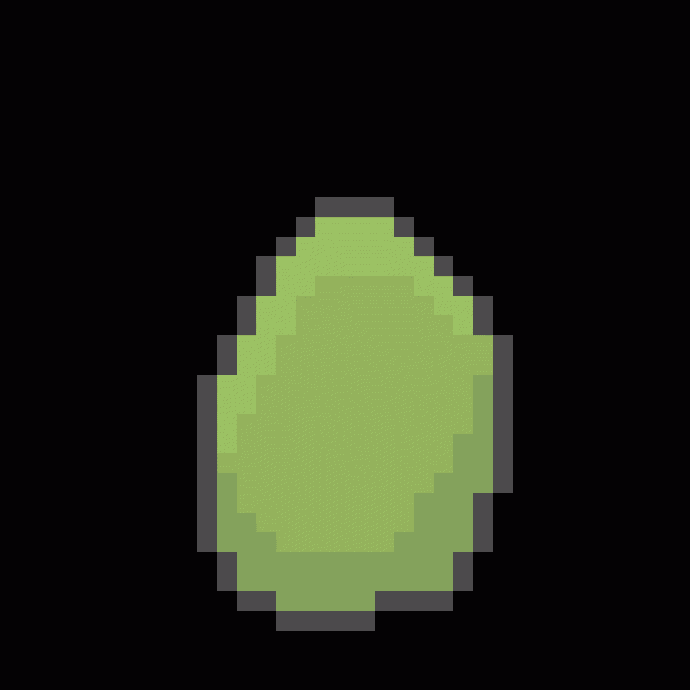

# {{ page.title }}

---

#### Too Many Parties (November 2017)
November was a very busy month for me... it seems there was at least one party every week. As such, there's not much I got done in terms of game development, but there is some progress though. One mini project that was supposed to take a few hours over a few days ended up taking a few hours over several weeks (thanks to the aforementioned parties). And it's still not finished! It was originally supposed to be a Halloween special, but as you can see, that didn't turn out as planned. Still, I'm not going to just abandon it - it's good experience! Here's a sneak peak and some more assets:

#### Side-quests (Mid October 2017)
Like any proper gamer, I am prone to getting distracted by side-quests. Like any proper game designer, I've come up with TONS of (mostly crazy) ideas for games I'd like to work on. The projects I've previously mentioned haven't had much progress at the moment, but I do plan on picking up their progress's pace in the future. Additionally, working on mechanics for a few of these new ideas has been slow, but enjoyable. It's also been keeping me from getting my programming skills rusty (at least, more than it already has lol). I haven't set up some capture software to show off these mechanics just yet, but I have some images of the assets I've made for a couple of these side projects. Can you guess from these images what these games might be about?

#### Deducing Deduction (September 2017)
I can't say much about this at the moment, except that it has to do with logic puzzles, AI, and a beloved fictional character. This particular project is still undergoing testing to see if the concept is viable. Of course, I'll make a demo and see what other people think of it before making any promises.

#### Couch Co-op Comeback (August 2017)
I've been experimenting with 3D controls and controller input with Unity, lately, in the hopes of getting more experience with 3D, 3rd person game mechanics, and console game development. Inspired by my childhood and awesome games like Overcooked, I plan to develop local co-op games for me and my friends to enjoy. And since Microsoft has so graciously blessed us developers with [some help](http://www.xbox.com/en-US/developers/creators-program), these games are likely to actually be published on a console!

#### Royal Dilemma (July 2017)
One of the games I've played recently  included a really cool empire-manager feature. However, I found the mechanics with this manager were a bit lacking (which is understandable, given that the game's focus wasn't solely on that feature). Noting the interesting bits and parts where such a feature could improve made the rusty creative gears in my head start grinding and so I've started designing the kind of kingdom management game that I would like to play.

.

