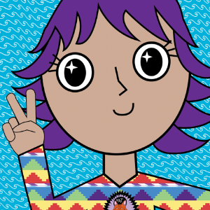
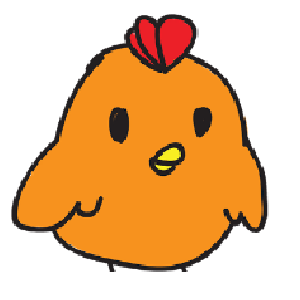
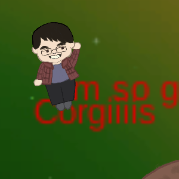
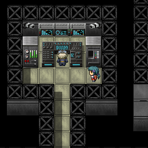
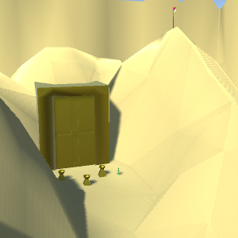

---
layout:	default
title:	Portfolio
---

# {{ page.title }}

### PAGE UNDER CONSTRUCTION
## Game Projects

<table style="width:100%;">
<tr>
<th>Selfie Surf</th>
<th>Pan-Fried Panic</th>
</tr>
<tr>
<td>  </td>
<td>  </td>
</tr>
</table>

-----

## A Bark in the Dark

Team Project | Platform(s): PC

A short survival horror game where the player must listen to avoid danger. In this game, the main character is a young child trying to find their pet dog while wandering haunted hallways in the dark. To make matters worse, a monster knows the child is there and is trying to hunt them down. The player must listen carefully for when the monster is approaching and utilize the tables to hide from the monster. Additionally, the player must avoid the squeaky cracks on the ground that attract the monster and listen for the paths that will eventually lead them to the child's dog, or face a grisly death. 

**[More...](s_abitd.md)**

.

.

.

-----

## Edgewin

Team Project | Platform(s): [PC](https://xuanf1.itch.io/edgewin-the-game)

This game is a action-based third-person shooter, though with unique mechanics (and a really silly premise) that makes it unique from other shooters. The Edgewin is on a journey through outer space to collect as many edgey items, upgrade his edge powers, and become the ultimate Edgelord. Along the way, he must deal with slowly draining health and avoid all manner of obstacles, including hunters, meteors, and really annoying shooting stars. 

**[More...](s_edgewin.md)**

.

.

.

-----

## Defier

Team Project | Platform(s): Card Game

Defier is an adventure card game set in Ancient Rome and inspired by the gameplay of the classic arcade game, PacMan. Each player selects one of four Roman heroes with unique abilities and compete against one another to slay the twin gods Apollo and Diana. Players create their own game field as they play with Exploration Cards and make their way to the center of the play field, in which they face off in an epic battle against the gods. Along the way, players slay the twin gods’ minions and explore monuments and dungeons, attaining greater power through gaining levels and collecting items.

**[More...](s_defier.md)**

.

.

.

-----

## Haven

Team Project | Platform(s): PC

A short, story-focused role-playing game set in a dark, cyberpunk world. In a dystopian future, the surface of the world has been nearly rendered unlivable due to pollution and climate change. People must hide away in structures and rely on the virtual world Haven in order to communicate and function. Additionally, a war is brewing between the corrupted company running Haven and the rebellion trying to bring them down. Jayden, an ordinary citizen with a talent for computer hacking, is thrust in the middle of this war when he is forced to take desperate actions to save his beloved Sloane, who requires medication to keep the poisonous effects of using Haven at bay.

Originally made for a course at UCI. This course emphasized narrative and its portrayal in computer games.

**More...**

.

.

.

-----

## The Lost Gold City of Gold

Solo Project | Platform(s): PC

A 3D first person exploration puzzle game. The player plays an archaeologist explorer traversing a desert canyon along with their  (green) archaeologist team in search of the Lost Gold City of Gold. The player must search for the keys in order to unlock the golden gate that may lead to the City, doing simple platforming puzzles in order to obtain them. Interacting with the other members of the team gives the player hints as to where to go or how to obtain certain keys.

Originally made for a course at UCI. This course emphasized the creation of 3D models. All the models in the game were custom created using Autodesk Maya.

**More...**

.

.

.

-----