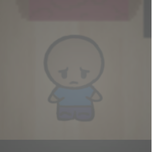

---
layout:	default
title:	Portfolio
---

# {{ page.title }}

## Introduction
Here is a list of projects I have contributed to. Feel free to check them out.

## Selfie Surf

Platform(s): Android, iOS

* Won second place for Best Game in the IEEE GameSIG 2017 Showcase

Selfie Surf is a single-device party game for mobile, inspired by the game "Telephone." Players start with a random word or phrase and then take a selfie-based on that word. They then hand the phone to the next player, who enters a word or phrase based on that selfie. They hand the phone to the next player, who takes another selfie until everyone has taken a turn. All players can now watch an animated sequence of everyone's pictures coupled with the words and see what's lost (or gained!) in translation. The game supports 4-16 players.
[More...](selfiesurf.md)

## Pan-Fried Panic

Platform(s): Android

Pan Fried Panic is a 2 VS 2 frantic cooking game in which the goal is to prepare food faster than the other team. This is accomplished through fast-paced minigames requiring the coordination of both players on your team to set up. The game currently features baking cakes and the first team to work together to bake three cakes the fastest wins.

Developed as a part of the Capstone course for the Computer Game Science Major at the University of California.[More...]

Check it out on the [Google Play Store](https://play.google.com/store/apps/details?id=com.ABI.PanFriedPanic&hl=en).

## A Bark in the Dark

Platform(s): PC

A short survival horror game where the player must listen to avoid danger. In this game, the main character is a young child trying to find their pet dog while wandering haunted hallways in the dark. To make matters worse, a monster knows the child is there and is trying to hunt them down. The player must listen carefully for when the monster is approaching and utilize the tables to hide from the monster. Additionally, the player must avoid the squeaky cracks on the ground that attract the monster and listen for the paths that will eventually lead them to the child's dog, or face a grisly death. [More...]

.

## Edgewin

Platform(s): PC

Check it out on [itch.io](https://xuanf1.itch.io/edgewin-the-game).

## Haven

Platform(s): PC

## The Lost Gold City of Gold

Platform(s): PC

