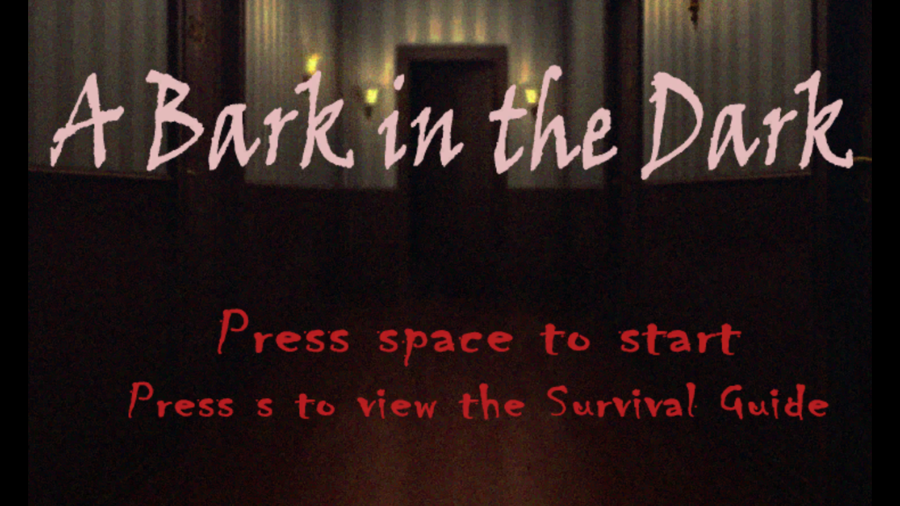
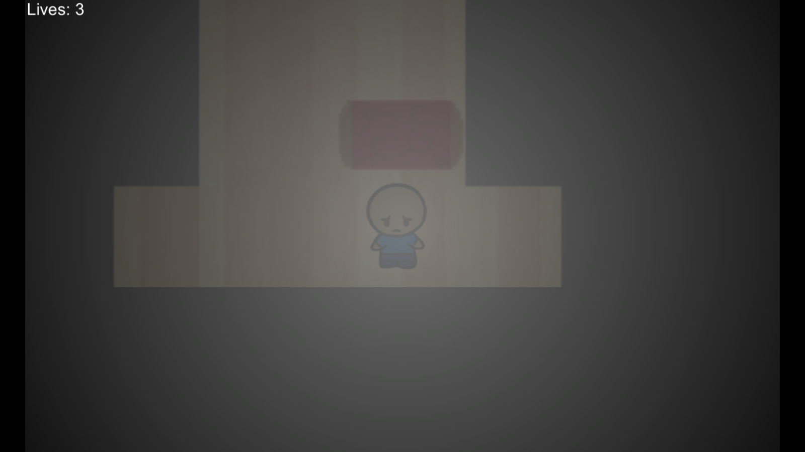
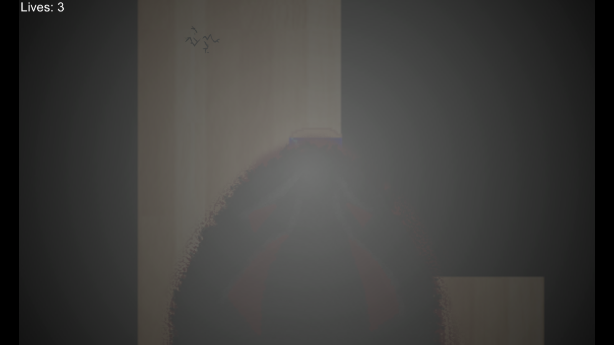

---
layout:	default
title:	A Bark In The Dark
---

# {{ page.title }}

 

## About
Team Project | Platform(s): PC

A short survival horror game where the player must listen to avoid danger. In this game, the main character is a young child trying to find their pet dog while wandering haunted hallways in the dark. To make matters worse, a monster knows the child is there and is trying to hunt them down. The player must listen carefully for when the monster is approaching and utilize the tables to hide from the monster. Additionally, the player must avoid the squeaky cracks on the ground that attract the monster and listen for the paths that will eventually lead them to the child's dog, or face a grisly death. 

## Contribution

#### Programmer
I was one of two programmers working on the implementation of the game. I was mainly in charge of the mechanics that provided obstacles to the player, such as the monster and the cracks on the floor. The monster was made to seem like it was constantly wandering to search for the player, but it was really being spawned roaming in a random direction based around the area the player was in when it spawned. It would then despawn if the player got too far away from it. The cracks on the floor also creaks loudly when the player walks over them. When this happens, it decreases the time it takes for the monster to spawn, making it seem like the creaks were attracting the monster to the player's position.

#### Game Design
I worked with the rest of my teammates to come up with the overall design and gameplay of the game.

## Development
This game was developed within six weeks and developed by students with extremely conflicting schedules. Words cannot express how difficult it was to work on this game with so little time to meet up and discuss the game while everyone's attention was divided by late semester school madness. It wasn't always bad and the team had fun working together, but I definitely learned to try to not take on too many projects at once.

During development, there was definitely some scope creep. One of the early mechanics that we wanted to implement was the flashlight, which the player can use to scare away the monster. The flashlight would run out off battery and players would have to explore to find more batteries to keep it running. However, this proved to be too difficult to do in the time that we had, so it had to be cut from the game entirely. This was a bit of a disappointment, as we were all looking forward it and we had a certain attachment to it due to it being one of our earliest ideas. But in the end, it's better to have a complete game rather than a game with a poorly implemented mechanic.