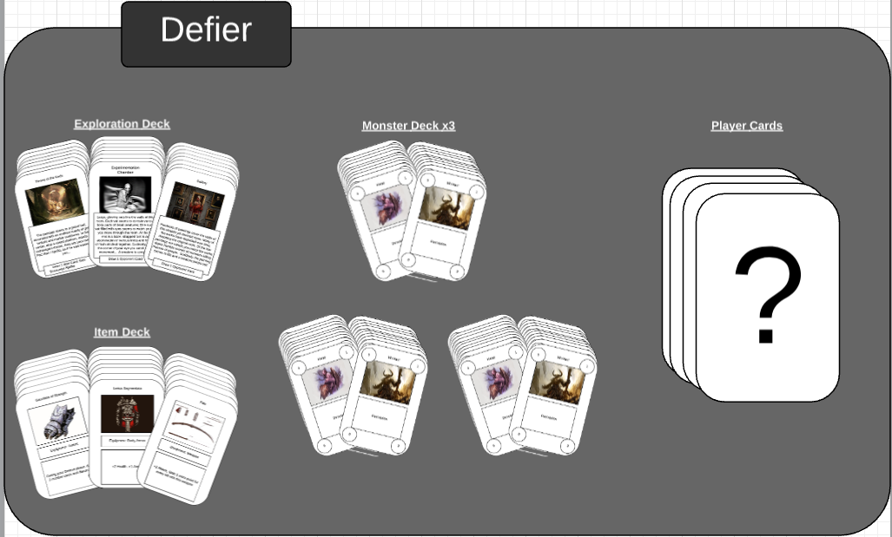
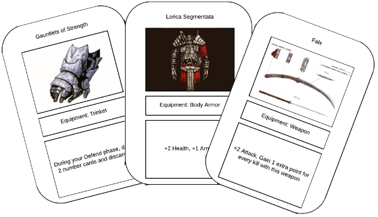

---
layout:	default
title:	Defier
---

# {{ page.title }}

 

## About
Platform(s): Card Game

Defier is an adventure card game set in Ancient Rome and inspired by the gameplay of the classic arcade game, PacMan. Each player selects one of four Roman heroes with unique abilities and compete against one another to slay the twin gods Apollo and Diana. Players create their own game field as they play with Exploration Cards and make their way to the center of the play field, in which they face off in an epic battle against the gods. Along the way, players slay the twin gods’ minions and explore monuments and dungeons, attaining greater power through gaining levels and collecting items.

The twin gods Apollo and Diana have forsaken your people and are bent on destroying Rome! They have conjured a disheveled copy of Rome underground and whatever damage is dealt to the structures there will be reflected onto the original. The mirrored city is riddled with creatures and horrors known only by man’s tongue for anyone foolish enough to raise their sword against the gods. The emperor of Rome makes a royal decree to slay the Gods, sending only but his four finest warriors - Iovita, Blinkus, Prisca and Claudius to the underworld to slay the gods and reclaim Rome’s former glory.

## Contribution

#### Game Design

#### Testing

#### Other
I provided the materials for and printed the final version of the card game. I also did a lot of paper cutting and casing.

## Development
