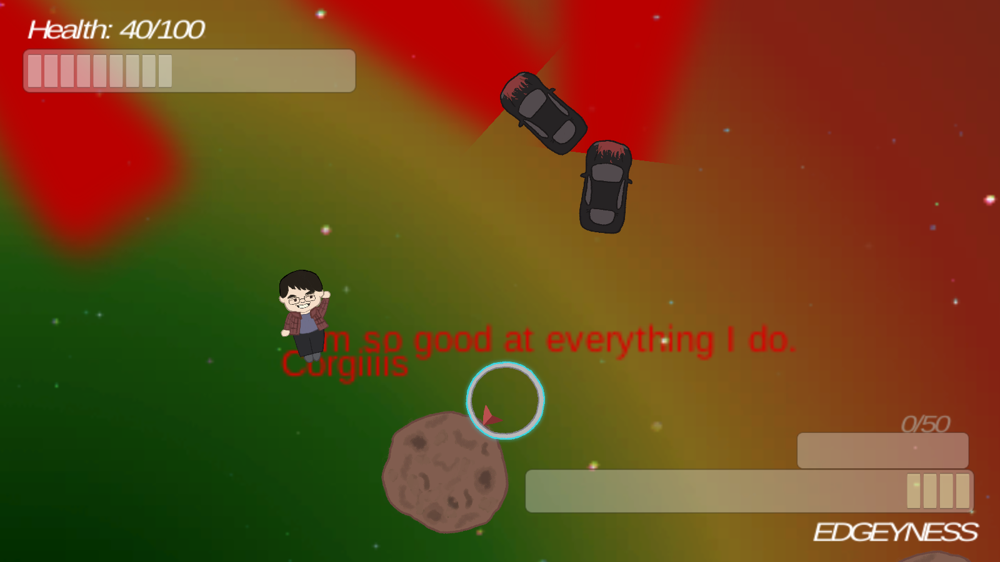

---
layout:	default
title:	Edgewin
---

# {{ page.title }}
 

## About
Platform(s): [PC](https://xuanf1.itch.io/edgewin-the-game)

This game is a action-based third-person shooter, though with unique mechanics (and a really silly premise) that makes it unique from other shooters. The Edgewin is on a journey through outer space to collect as many edgey items, upgrade his edge powers, and become the ultimate Edgelord. Along the way, he must deal with slowly draining health and avoid all manner of obstacles, including hunters, meteors, and really annoying shooting stars. 

This game was originally made for the VGDC Spring 2017 Game Jam, in which the theme given was "not enough edges" which was a joke within the club. Additionally, the game's silly premise came from a series of in-jokes concerning friend of the team and then VGDC President Edwin Ho.

Check it out on [itch.io](https://xuanf1.itch.io/edgewin-the-game).

## Contribution
#### Programming 
I was one of the multiple programmers on the team. I was mainly in charge of the user interface during gameplay. I implemented the display of the health bar and the "edgeyness" bar(s), working with other programmers to make sure these amounts were calculated and displayed correctly. I also implemented the compass that directs the player to the base.

#### Testing
While we all generally tested the mechanics we've developed, I playtested the entirety of the game an extreme amount of times in order to experience the game from the perspective of an average user and help the other programmers identify bugs or notable issues. My testing also helped the other programmers determine gameplay pacing and changes. Also the game was just that fun to play.

#### Game Design
I assisted my teammates in working out the specifics in the design of the game.

#### Sound Design
I selected the music for the game.

## Development
This game was developed during a game jam, which means development could only take place within 48 hours. Though it seems intimidating to make a game within that time constraint, actual development wasn't as bad due to the fact that our team had multiple programmers. Team members could focus on the work of their own position, as we had a dedicated artist and game designer. It was a little bit slow to come up with a game design and divide the tasks between the members of the team (we had to borrow a producer to work that out). We also had to take some time to get to know each other, as most of the members never worked together before.