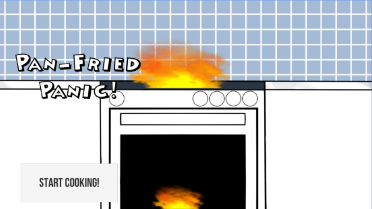
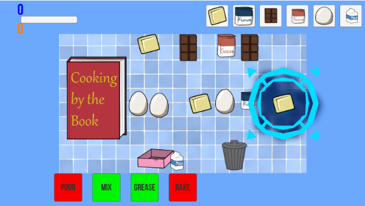

---
layout:	default
title:	Pan-Fried Panic
---

# {{ page.title }}

 

## About
Team Project | Platform(s): [Android](https://play.google.com/store/apps/details?id=com.ABI.PanFriedPanic&hl=en)

Pan Fried Panic is a 2 VS 2 frantic cooking game in which the goal is to prepare food faster than the other team. This is accomplished through fast-paced minigames requiring the coordination of both players on your team to set up. The game currently features baking cakes and the first team to work together to bake three cakes the fastest wins.

Developed as a part of the Capstone course for the Computer Game Science Major at the University of California in Irvine.

Check it out on the [Google Play Store](https://play.google.com/store/apps/details?id=com.ABI.PanFriedPanic&hl=en).

## Contribution
#### Programming
I was one of the multiple programmers on the team working on the game. I was mainly in charge of the minigame known as "Pour." This minigame used the mobile phone's tilt sensor to emulate pouring batter from the mixing bowl to the cooking pan. I also contributed some programming to a few miscellaneous mechanics and other minigames. I also assisted my teammates with their coding and debugging.

#### Game Design
The whole team worked together to work out the overall design of the game, including how each minigame would work. The person in charge of their own minigame/scene were also in charge of designing the more specific aspects to that minigame/scene and how it was implemented. For instance, I was in charge of the minigame known as "Pour" and how it worked, but the general idea for the gameplay was determined by the team together.

## Development
This game was developed over the course of seven months and was for the Capstone course of the Computer Game Science Major at UCI.

Working on this project and with this team gave me significant experience working on a team and did wonders to improve my skills regarding teamwork. Though I was able to work well enough on a team before, I am much more proficient and confident in this area, where previously I had some not so great experiences. This experience was able to transfer well to later projects and later teams.