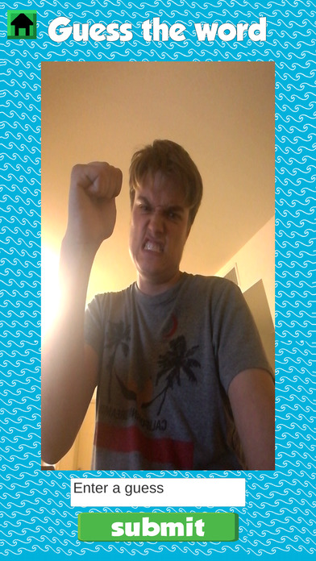

---
layout:	default
title:	Selfie Surf
---

# {{ page.title }}

 

## About
Platform(s): Android, iOS

> 2nd Place Winner for Best Game Showing Commercial Viability in the IEEE GameSIG 2017 Showcase

Selfie Surf is a single-device party game for mobile, inspired by the game "Telephone." Players start with a random word or phrase and then take a selfie-based on that word. They then hand the phone to the next player, who enters a word or phrase based on that selfie. They hand the phone to the next player, who takes another selfie until everyone has taken a turn. All players can now watch an animated sequence of everyone's pictures coupled with the words and see what's lost (or gained!) in translation. The game supports 4-16 players.

Originally made during the 2017 Global Game Jam for Android mobile devices, the team has since expanded upon the core game to include themed words and modified it for functionality on a iOS mobile device. The team is currently brainstorming ideas that may be added in the future.

Check it out on the 
[iOS App Store](https://itunes.apple.com/us/app/selfie-surf/id1248211292?ls=1&mt=8) 
and 
[Google Play Store](https://play.google.com/store/apps/details?id=com.Abi.SelfieSurf).

## Contribution
#### Programming
I am one of the multiple programmers on the team working on the game. I am mainly responsible for the randomized word generator. Essentially, the script that I coded takes words from lists stored in text files and randomly selects one to display at the top of the screen. This is the word that starts off the main part of the gameplay. Other than that, I helped my teammates with their coding and debugging. 

#### Game Design
The whole team worked together to help come up with and work out ideas for the game design. I helped worked out the fine details through discussions and testing during development.

#### Sound Design
I selected the music for the game. The game, being a fun party game, needed fun party music and Kevin Macleod's Incompetech site, which has a large variety of royalty free music, was able to provide it.

## Development

As stated before, this was originally made for the 2017 Global Game Jam. As such, we initially only had 48 hours in order to come up with a game idea and develop it. 

The team (which we have started calling ABI productions, thanks to an in-joke) consisted of five people, including myself, which was a bit smaller than most of the other teams that participated in the Game Jam at UCI. All members of the team are normally programmers and designers, though some of us worked on less familiar jobs such as the art, graphics, and sound.

As I recall, initial designing didn't take much time. It helped that we had a good idea of what features we wanted before hand, which sped up the design process quite a bit. 