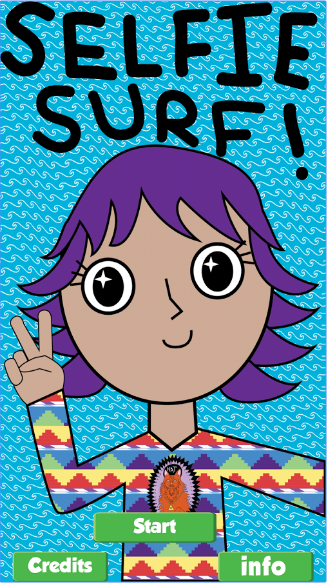
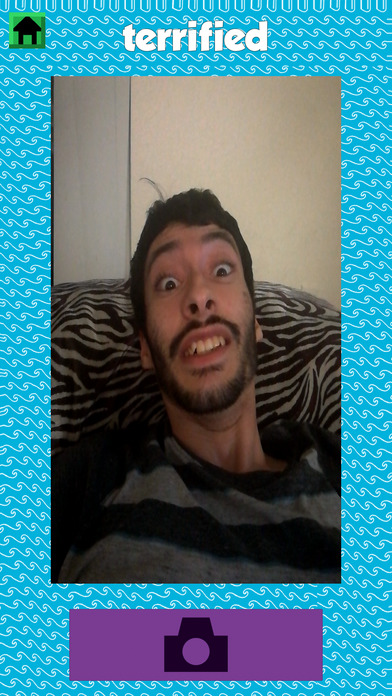

---
layout:	default
title:	Selfie Surf
---

# {{ page.title }}

 

## About
Platform(s): Android, iOS

> Won 2nd Place for Best Game Showing Commercial Viability in the IEEE GameSIG 2017 Showcase

Selfie Surf is a single-device party game for mobile, inspired by the game "Telephone." Players start with a random word or phrase and then take a selfie-based on that word. They then hand the phone to the next player, who enters a word or phrase based on that selfie. They hand the phone to the next player, who takes another selfie until everyone has taken a turn. All players can now watch an animated sequence of everyone's pictures coupled with the words and see what's lost (or gained!) in translation. The game supports 4-16 players.

Originally made during the 2017 Global Game Jam for Android mobile devices, the team has since expanded upon the core game to include themed words and modified it for functionality on a iOS mobile device. The team is currently brainstorming ideas that may be added in the future.

Check it out on the 
[iOS App Store](https://itunes.apple.com/us/app/selfie-surf/id1248211292?ls=1&mt=8) 
and 
[Google Play Store](https://play.google.com/store/apps/details?id=com.Abi.SelfieSurf).

## Contribution

## Development Lessons
